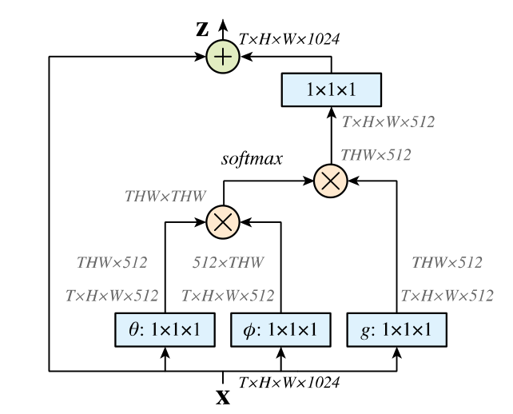

# Non-local-Neural-Networks-keras-Custom
Practice after reading paper using keras.
# Non-local Neural Networks论文学习与实现

## 前言

在目前的网络结构中，如在序列数据中基本是使用循环操作；在视觉数据中，基本上是使用卷积操作进行处理。无论是卷积操作还是循环操作都只是对局部邻域的一个处理。如果要获取距离较远的数据联系，则需要重复使用这样的局部操作，而这会产生一定的限制：

* 计算效率低下；
* 导致难以处理的优化问题；
* 让多跳跃的依赖性建模变得更加的困难。

在文章中，作者提出了一种非局部处理的结构，这种结构启发于经典的非局部平均运算，能在大多数的计算机视觉结构中得到应用。这种**非局部处理**把一个位置的响应计算为**输入特征中的所有位置的特征加权和**。这些位置可以是在时间、空间或者是时空中，这预示这种操作可以**适用于图像、序列和视频问题**。

这种非局部操作有一定的优势：

* 与循环、卷积操作不同，非局部操作直接通过两个位置的交互来得到它们之间的依赖性，而**不管**它们的距离；
* 非局部操作非常高效，能在很浅的网络里得到一个很好的效果；
* 非局部操作的输入是一个变量，是可改变了，这让它可以与其它操作进行结合，如卷积操作。

## Non-local Neural Networks

### 公式
定义非局部响应的计算公式：

i是要求响应的位置，j是与之相关的所有位置；

* f计算两点间的关联系数，得到一个标量；
* g是对计算输出表示；
* 是归一化参数。

非局部操作考虑了所有与选择点相关的其他位置。与**卷积操作**比较，卷积只考虑了在局部一定范围内的位置的特征加权和。与**全连接 (fc)** 比较，非局部操作计算响应依赖于两位置之间的关系，而fc依靠的是可学习的权重；两位置之间的关系是非局部操作中的函数，而fc没有这种功能；此外，fc的输入、输出是固定的，非局部操作的输入、输出是灵活可变的，可以适应很多场合，并且可以在低层加入，与更多的其他操作进行组合。

### Instantiations
关于f和g的选择自由多变，但是这不是决定因素，通过多个实例可以看出，效果的提高是因为非局部操作。

对于g，方便实现，考虑简单嵌入形函数：

* $W_g$是需要学习的权重方针；
* 可以考虑空间的1x1卷积或者时空的1x1x1卷积。

对于f，可以有很多的形式：

* Gaussian：.
* Embedded Gaussian：.
* Dot product：, 取$\operatorname{C}(x)=N$，这可以简化求梯度的操作。因为输入的size是可变的，所以归一化操作是必须的。
* Concatenation：, 同样，取$\operatorname{C}(x)=N$。

f和g的选择是非常灵活了，还可以有其他的形式。

### Non-local Block
由non-local计算公式来表示一个block：

其中，是前式的，表示为前层的**残差项**。这个残差项让我们可以把non-local block插入到任何一个预先训练的模型中而不破坏他们的初始化行为。

* 上图的block加入了一个瓶颈结构；
* 可以把和操作去掉来实现非嵌入的高斯版本；
* 可以把softmax变为1\N的缩放来实现点乘的版本。

可以通过**下采样**来优化计算，如在和g操作后加入一个池化层，在空间域将减少1/4的计算量。实际上，简化后的式子为：

## 

## 实现

[https://github.com/seiei17/Non-local_Net_keras_Custom](https://github.com/seiei17/Non-local_Net_keras_Custom)
